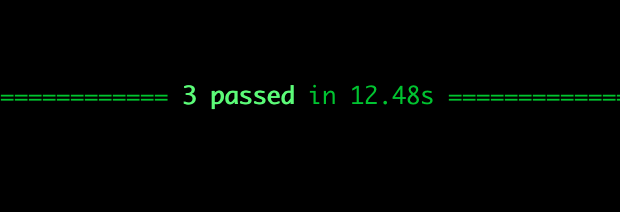

# Localstack-pro GDC Blueprint-1
This is a LocalStack Pro - GDC (generic dev container) blueprint. 
The same [Pulumi](https://www.pulumi.com/registry/packages/aws/) pipelines deploying this solution to LocalStack can be used to deploy to AWS.
It uses the GDC to provide a containerized development environment. The GDC runs LocalStack-Pro and an Auth0Mock. 
The GDC can be used with any IDE and works on Mac, Windows, Ubuntu.

### Jump to [Quickstart](#quickstart)

## Project Overview
Deploys system to AWS with backend and frontend. Some extra features like RDS and some UI features are stubbed
out. 
This project has a API Gateway (APIGW) REST endpoint, and an APIGW WebSocket (WS) endpoint. Auth is provided by Auth0Mock.
The UI is Vue.js+tailwind hosted in CloudFront (when deployed to AWS).

## UI Pics
The UI has two parts, a public side, and a private portal. The public side is minimal, but this is where you could host your
public content and then let users login to the auth-protected private portal.
### Public side
Click on the button text to enter the protected portal. 


### Login using Auth0Mock
The username and password are populated for you. You can see them in [users-local.json](./users-local.json). The default
username and password are configured in [.env-gdc](./.env-gdc).


### Light Dark Mode
Once you're logged in, the light and dark mode selection is the popover in the upper right hand corner. The other buttons in the popover do nothing.
Logout is in the lower left hand corner. All of these screen snaps are in dark mode.


### S3Files Storage
This project uses an adjacency model to store users and s3item documents in DynamoDB. The actual files are sore


### Open Add Files
Open the model to upload files to S3Storage.


### Store S3 Files
Upload files to a protected private bucket using presigned S3 URLs. This is a multi-file upload modal. You can drop many files
in at once. The first upload will take some time (a few extra seconds) as the Lambda ColdStarts in LocalStack will take a few seconds. 
The subseqeunt uploads are very fast as long as the Lambdas haven't timed out and you're back at another cold start.


### File List
Then your files will appear in your file list. You may have to refresh no your very first upload. See [Known Issues](#known-issues).


### Delete File
Hovering on a file line shows the menu for that item. You can delete it here. First delete is longer (ColdStart).


### Tag Files
You can add tags/labels to files.


### File Details
Double-clicking on a file will open a S3File detail page. This page does nothing at this time.


### Developer Platform


### Known Issues
The WebSocket server returns a blank message for the very first message after the WS endpoint is deployed to LocalStack.
1. This makes the tests fail the very first time they are run.
2. This makes the UI miss the first WebSocket message if no tests are run before using the UI. So, you just have do a browser reload after uploading a file for the first time.

After the `kinesis_mock_server` times out, the DynamoDB Stream handler Lambda will never get triggered again. And all WS messages stop flowing from the backend. Restart of the GDC and LocalStack is required at this point.
This only happens when the system sits idle for awhile, not sure how long. Ref: [LocalStack Issue 5182](https://github.com/localstack/localstack/issues/5182)

## Quickstart

### Setup

1. [GDC](https://gitlab.com/probello/generic-dev-container) install. 
2. Follow GDC Setup instructions. (Install DockerDesktop)
3. Clone this repos


1. Create a file calle `.env` in the root of this repo. Put your Localstack Pro key in it like this

```shell
export LOCALSTACK_API_KEY=YOUR_KEY_HERE
```

2. Start GDC

```shell
# from the root of the cloned repo
~/<gdc dir>/run-dev-container.sh
```

5. Deploy the system to Localstack

```shell
# Open GDC shell
docker exec -it lsgdc-dev-1 bash -l
make local-toplevel-deploy
make local-db-deploy
make local-lsgdc-deploy
```

6. Run UI

```shell
# Open GDC shell
docker exec -it lsgdc-dev-1 bash -l
make local-lsgdc-run-ui
```

7. Login to UI
   Navigate to http://localhost:3030/

## Run tests

Everything is done from inside the GDC shell.

1. Open GDC shell

```shell
docker exec -it lsgdc-dev-1 bash -l
```

2. Create Python virtual env
   You only have to do this once.

```shell
make setup-venv
```

3. Run tests

```shell
# Run a hard-coded test 
make local-lsgdc-test-tags
```
The first WebSocket message sent by the server always sends an empty message. I don't know why yet. See [Known Issues](#known-issues).
So, the first time you run the tests, if you haven't launched and used the UI to upload a file to S3 yet, they will fail.


All subsequent runs should pass.


